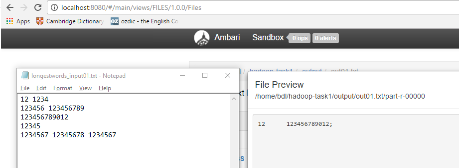
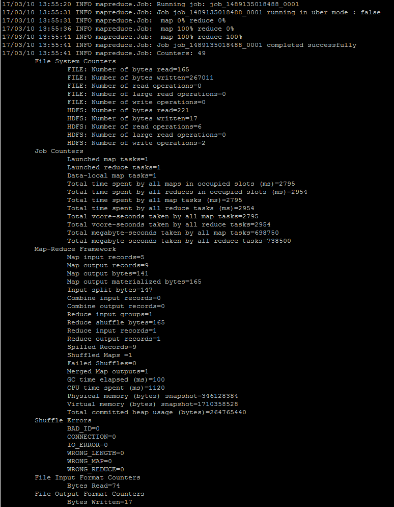
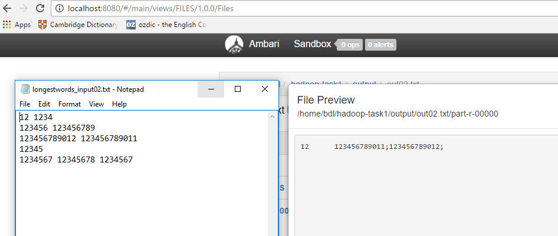
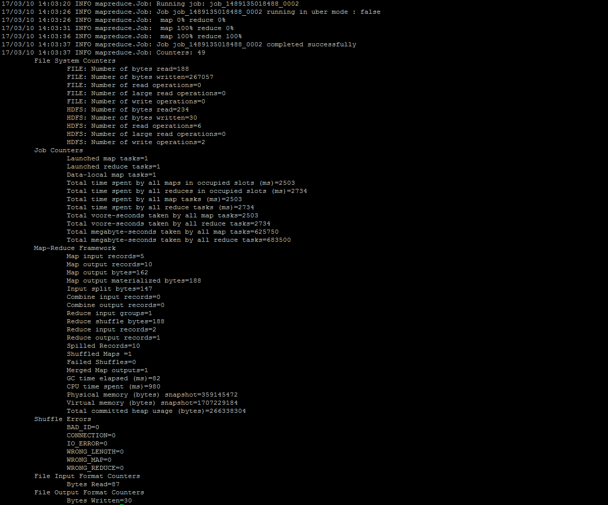

### Description
Project returns the longest words with its length

### Prerequisites:
-input files (on HDFS)

To upload files from hadoop server:
```
hdfs dfs -put ./examples/* /home/bdl/hadoop-task1

```


### How-to run 
```
hadoop jar Task1-0.0.5-SNAPSHOT.jar BD.Hadoop.Task1.LongestWords /home/bdl/hadoop-task1/longestwords_input02.txt /home/bdl/hadoop-task1/output/out02
```


### Results
See test files in "examples" folder:
1. longestwords_input01.txt - returns 1 word



2. longestwords_input01.txt - returns 2 words in output file (the case when several words have the same length)

