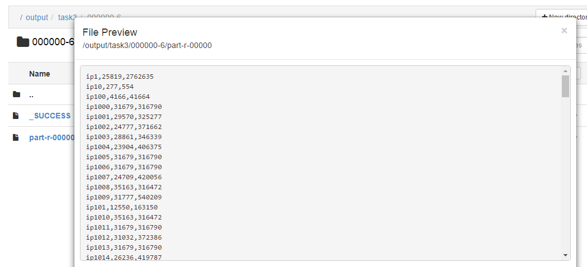
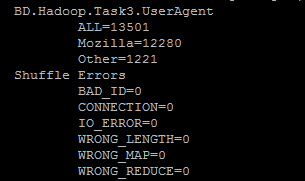
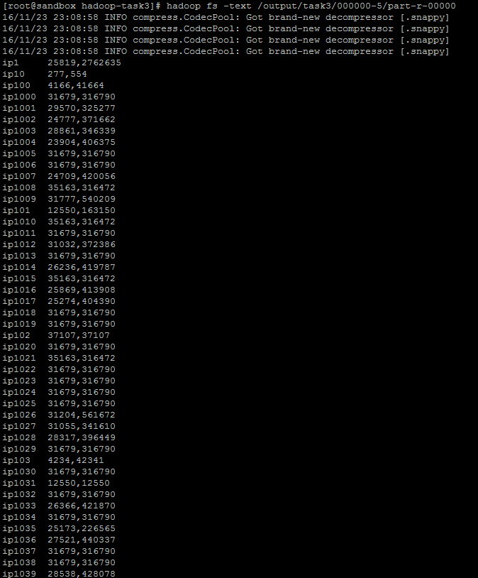

#How-To Run#
Usage: LogAnalyzer <input path> <output path> <output format ('csv' (default) or 'snappy')>

Examples:

hadoop jar Task3-0.0.5-SNAPSHOT.jar BD.Hadoop.Task3.LogAnalyzer /input/task3/000000 /output/task3/000000-5

hadoop jar Task3-0.0.5-SNAPSHOT.jar BD.Hadoop.Task3.LogAnalyzer /input/task3/000000 /output/task3/000000-5 csv

hadoop jar Task3-0.0.5-SNAPSHOT.jar BD.Hadoop.Task3.LogAnalyzer /input/task3/000000 /output/task3/000000-5 snappy

#CSV results# (Screenshot 1)

#Counters# (Screenshot 2)
Look at counters starting with BD.Hadoop.Task3.UserAgent

#Snappy files# (Screenshot 3)

How-To See:
hadoop fs -text /output/task3/000000-5/part-r-00000

