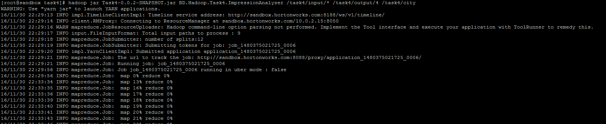
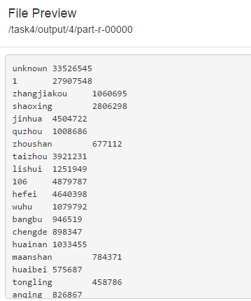

#How-To Run#
Usage: ImpressionAnalyzer <input path> <output path> <city file location>

Examples:
hadoop jar Task4-0.0.1-SNAPSHOT.jar BD.Hadoop.Task4.ImpressionAnalyzer /task4/input /task4/output /task4/city

#Uploaded HDFS Files# (Screenshot 1)

#Execution# (Screenshot 2)

#Result# (Screenshot 3)

